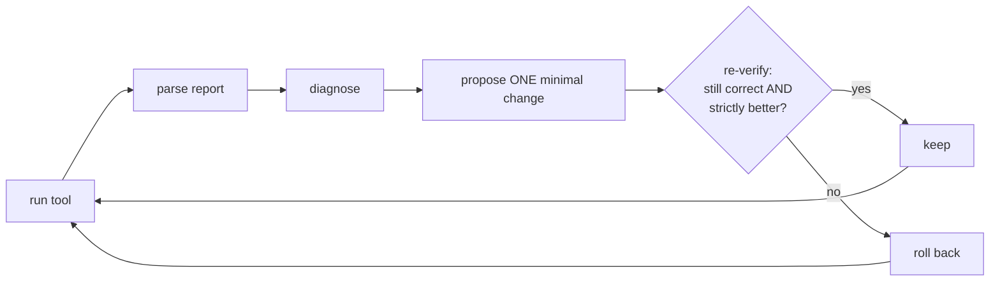

# HARPO

**A budget-aware LLM agent for HLS that repairs C/C++ kernels to correctness, then optimizes PPA — and never trusts a patch it hasn't re-verified.**


HARPO is not "we used an LLM to write HLS code." It is a closed control loop
for AMD **Vitis HLS** that spends its tool and LLM calls deliberately, under a
strict per-task budget, and leaves a replayable evidence trail for every
number it reports:



Three rules make it honest:

- **Correctness before PPA.** A design must pass C-simulation before any
  synthesis metric counts; a csim+csynth pass always outranks a non-pass.
- **Strict improvement or rollback.** Every optimization is kept only if it
  re-verifies correct *and* strictly improves a correctness-dominated,
  objective-driven score.
- **Budgeted autonomy.** csim / csynth / LLM invocations are metered per task;
  the agent reserves final verification calls before it spends on exploration.

The problem setting follows the task formulation of the **FPT'26 AMD FPGA
Design Competition, Track A (LLM4HLS)**; HARPO was built independently against
that formulation and is released as standalone research (see
[`paper/`](paper/) and [Origin](#origin-of-the-problem-setting)).

## Case study: the agent fixed the author's own 2024 design

The strongest demo in the repo is real, not synthetic:
[`tasks/lns_mac_001/`](tasks/lns_mac_001/) snapshots the LNS log8
multiply-accumulate unit from my 2024 MS project
([lns-log8-mac](https://github.com/phucducnguyen/lns-log8-mac)). The archived
design's own top-level `#pragma HLS PIPELINE` turns out to be the exact
over-parallelization failure mode this project is about:

| xc7z020 @ 10 ns | archived 2024 design | after **one** local-LLM call |
|---|---|---|
| csynth | fails timing, **168.7%** of the chip's LUTs | **passes** — fits, meets timing |
| LUT | 89,773 | **21,013** (39.5%) — 4.3× smaller |
| Worst latency | 3,433 cycles | **2,073** — 40% faster |
| Correctness | 10k-trial golden-model csim ✔ | re-verified ✔ |

The model's one-line fix (move the pragma to the inner loop, `II=1`) was
reproduced **3 out of 3** independent runs, with identical synthesis results,
by a local `qwen3.6:35b-a3b-q4_K_M` on a single consumer GPU — $0 in API
cost. On the upstream repo's own larger target (xczu9eg) the archived design
*passes* — while silently spending **4.2×** the area of the fixed one.
Meanwhile the deterministic recipe provider, which can only *add*
parallelism, had every proposal correctly rejected by the
`satisfice_then_area` objective.

Every number above traces to committed, replayable run records in
[`docs/case-study/`](docs/case-study/), each `propose` event tagged with the
model that produced it.

## Quick start

```bash
# csim works WITHOUT Vitis (g++ only) — repair + the correctness spine:
python3 scripts/selftest.py                                  # offline parser checks
python3 -m harpo run    tasks/vadd_001       --stage csim    # -> pass
python3 -m harpo run    tasks/vadd_buggy_001 --stage csim    # -> functional_fail
python3 -m harpo repair tasks/vadd_buggy_001 --provider mock,ollama

# csynth + the optimize/pipeline loops need Vitis HLS on PATH:
source <Vitis-install>/2025.2/Vitis/settings64.sh
python3 -m harpo run      tasks/vadd_001    --stage csynth --backend vitis_hls
python3 -m harpo optimize tasks/mac8_001    --provider recipe,ollama
python3 -m harpo pipeline tasks/vadd_buggy_001               # repair, then optimize
```

Each subcommand prints a JSON summary plus a one-line verdict on stderr and
writes a log under `runs/<task>/`:

- `repair`   → `"repaired": true` once a forked candidate passes csim
  (`vadd_buggy_001` is fixed in **2 steps / 1 LLM call** by the local model).
- `optimize` → `"improved": true` when a kept candidate beats the baseline
  (`mac8_001`: **interval_max 1024→256, latency 1026→259** at **0 LLM tokens**).
- `pipeline` → `REPAIRED+IMPROVED` when both phases land, on one shared budget.

Exit codes: `0` pass / repaired / improved · `1` fail / no improvement ·
`2` tool unavailable.

## Subcommands

| Command | What it does |
| --- | --- |
| `run <task> --stage {csim,csynth}` | Run **one** stage once; print the parsed report; write evidence. |
| `repair <task>` | Closed-loop **correctness** repair: csim → diagnose → patch → re-csim, under budget. |
| `optimize <task>` | **PPA** loop on an already-correct design: propose pragma → re-verify csim → csynth → keep iff score improves. |
| `pipeline <task>` | `repair` then (only if repaired) `optimize`, sharing **one** per-task tool budget. |

## Scoring — the three fixes

The score is lexicographic and correctness-dominated; within a tier, three
deliberate fixes keep the agent pointed at the *right hardware objective*:

1. **Metric.** Throughput is scored on the design-level **`interval_max`**,
   never per-loop `ii` — a fully-unrolled loop reports `ii = None`, which used
   to sort as 0 and spuriously reward over-unrolling. `interval_max` is always
   reported and monotone; `ii` is diagnostic-only.
2. **Policy.** A per-task **objective** enum — `speed_first | area_first |
   adp | satisfice_then_area | pareto_report` (default `satisfice_then_area`) —
   picks the PPA ordering: meet the throughput target, *then* minimize
   normalized area (`area.py`), then ADP. The agent doesn't blindly chase the
   fastest design.
3. **Autonomy.** When a task gives no throughput target, a recipe-only,
   **0-token**, capped probe (`probe.py`) derives one before the loop runs.

## Backends and providers

**Backends** (the tool runner — `--backend` / `--csim-backend` / `--synth-backend`):

- `gpp` — host C++ compile + run = functional **csim** equivalent, no Vitis
  needed (g++ ignores `#pragma HLS`). Won't catch non-synthesizable constructs;
  those need the real tool.
- `vitis_hls` — real Vitis HLS flow (csim + csynth) via a generated
  `run_harpo.tcl`. Part / clock / sources are **injected from the task**, never
  hardcoded.

**Providers** (who proposes a patch — `--provider`, comma-separated, tried in order):

- `mock` — deterministic string-replacement patcher (tests/demo; reads the
  task's optional `mock_patch.json`). No tokens.
- `recipe` — deterministic, non-LLM library of *precise*,
  correct-by-construction HLS pragmas, emitted one at a time. No tokens.
- `ollama` — best-effort LLM patcher over a **local** Ollama server (stdlib
  `urllib` only; never raises — degrades to the next provider on any failure).
  Endpoint/model from **`HARPO_OLLAMA_URL`** / **`HARPO_OLLAMA_MODEL`**; the
  model tag is recorded in every run's evidence. Repair defaults to
  `mock,ollama`; optimize to `recipe,ollama`.

## Evidence and results

Every run writes replayable JSON under `runs/<task_id>/` — per-candidate tool
output + parse, and a full phase log with the event trail, budget spend, token
account, and per-candidate scores.

The **single source of truth for suite results is
[`docs/ablations/canonical/TABLE.md`](docs/ablations/canonical/TABLE.md)** —
one row per kernel × method (baseline / recipe / raw-LLM). Regenerate it from
the run logs:

```bash
python3 scripts/run_ablation.py     # (re-)run the kernels (needs Vitis)
python3 scripts/ablation_table.py   # JSON -> docs/ablations/canonical/TABLE.md (+ .csv)
python3 scripts/pareto_view.py      # optional -> PARETO.md
```

Highlights (full numbers in the table; the recipe-vs-LLM area lesson in
[docs/RESULTS.md](docs/RESULTS.md)):

- **9 kernels** — 5 hand-built + 3 PolyBench ports + the real-artifact LNS MAC
  case study — plus repair fixtures (`vadd_buggy_001`, …).
- Under `satisfice_then_area`, the deterministic **recipe** provider meets the
  throughput target at **0 LLM tokens** and decisively beats the raw LLM on
  the over-parallelizing kernels (`mac8_001` `interval_max 1024→256`,
  `matmul_001` `256→44`).
- Where no target is given (`atax_001`, `bicg_001`, `lns_mac_001`), the probe
  supplies the ceiling at 0 tokens before the loop runs.
- **120 unit tests green:** `python3 -m unittest discover -s tests`.

Toolchain was proven via two Gate-0 milestones on Linux with **Vitis HLS
2025.2** (free on Linux pre-2026.1) — including the install gotcha (the 2025.2
unified installer omits the `bin/vitis_hls` launcher). See
**[GATE0.md](GATE0.md)**.

## How it works (longer version)

The control loop, candidate isolation, budget policy, the objective-driven
score, the correctness-preserving invariant, and the provider protocol (so you
can add a provider) are documented in
**[docs/ARCHITECTURE.md](docs/ARCHITECTURE.md)**.

## Tasks are dev fixtures, not the competition's

The competition supplies its own task bundles (kernel, target part, tool
version, budget config). The kernels under `tasks/` are dev fixtures; the
runner takes part / clock / tool / budget as **injected config** (`spec.json`,
`constraints.json`, `budget.json`), never hardcoded — so the same agent runs
the evaluator's tasks unchanged. Tasks may vendor extra headers for the
host-csim backend via the spec's `include_dirs` key (e.g. the standalone
`ap_int.h`; the real tool always uses its own shipped headers).

## Layout

```
harpo/        Python package (stdlib only):
  task.py         load a task bundle -> TaskContext
  runner.py       backends: gpp (g++ csim) | vitis_hls (real csim+csynth via tcl)
  parser.py       parse_csim / parse_csynth (Vitis XML -> metrics)
  diagnosis.py    parser status -> Diagnosis (rule-based, deterministic)
  patch_engine.py PatchProvider protocol; MockProvider, OllamaProvider; check_contract, apply_patch
  recipes.py      RecipeProvider + the precise-pragma catalogue
  candidate.py    CandidateManager (isolated src copies) + score()/best()/pareto_front()
  area.py         area_score (normalized utilization) + adp (area-delay product)
  probe.py        recipe-only 0-token throughput-target probe (when none given)
  budget.py       BudgetManager + policy_allows (the Track-A spine)
  agent.py        run_repair / run_optimize / run_pipeline
  store.py        per-run JSON evidence
  cli.py          run / repair / optimize / pipeline
scripts/          selftests, run_suite.py, run_ablation.py + ablation_table.py,
                  pareto_view.py, family_sweep.py (case-study cross-part table)
tasks/            dev fixtures: 5 hand-built + 3 PolyBench + lns_mac_001 (real
                  artifact) + repair fixtures (vadd*, scale*)
docs/             ARCHITECTURE.md, RESULTS.md, ablations/canonical/TABLE.md,
                  case-study/ (real-artifact evidence), TRACK-A-COVERAGE.md
runs/             per-candidate run artifacts + phase logs (gitignored)
GATE0.md          toolchain gates (0a csim / 0b csynth) — PASSED
```

## Origin of the problem setting

The task formulation — budgeted LLM4HLS with a correctness-dominated ranking
rule — comes from the **FPT'26 AMD FPGA Design Competition, Track A (LLM4HLS)**
(`fpt2026.uark.edu/fpt26-design-competition`). HARPO was built independently
against that formulation and is released as standalone research; it was not
entered into the competition. An honest map of what HARPO covers of the
Track-A task taxonomy (proven / partial / gap, verified against the code) is
in **[docs/TRACK-A-COVERAGE.md](docs/TRACK-A-COVERAGE.md)**.

## Paper

The preprint source lives in [`paper/`](paper/) (IEEE two-column; build
instructions in [paper/README.md](paper/README.md)). Every quantitative claim
in it traces to
[docs/ablations/canonical/TABLE.md](docs/ablations/canonical/TABLE.md).

## License

MIT — see [LICENSE](LICENSE).
